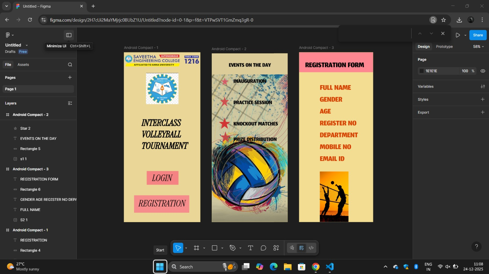

# Ex08 Event Registration Web Application
## Date: 24-12-2025

## AIM:
To design, develop and deploy a web application for event registration using Figma UI tool.

## UI DESIGN TOOL:
Figma

## DESIGN STEPS:

### Step 1:
Use frames to represent screens or sections.

### Step 2:
Add column grids for consistent spacing and alignment.

### Step 3:
Insert shapes, text, buttons, and icons.

### Step 4:
Use Auto Layout for flexible, responsive design.

### Step 5:
Define color, text, and effect styles globally for consistency.

### Step 6:
Name layers logically and group related elements.

### Step 6:
Link frames to show navigation or interactions.

### Step 7:
Select the specific frame while generating code using Anima plugin.

## CODE:
```
<html>
  <head>
    <meta name="viewport" content="width=device-width, initial-scale=1" />
    <meta charset="utf-8" />
    <link rel="stylesheet" href="globals.css" />
    <link rel="stylesheet" href="style.css" />
  </head>
  <body>
    <div class="android-compact">
      
      
      <div class="INTER-CLASS">INTER-CLASS<br />VOLLEYBALL<br />TOURNAMENT</div>
      
      <div class="rectangle"></div>
      <div class="text-wrapper">LOGIN</div>
      <div class="div"></div>
      <div class="text-wrapper-2">REGISTRATION</div>
    </div>
  </body>
</html>

@import url("https://cdnjs.cloudflare.com/ajax/libs/meyer-reset/2.0/reset.min.css");
* {
  -webkit-font-smoothing: antialiased;
  box-sizing: border-box;
}
html,
body {
  margin: 0px;
  height: 100%;
}
/* a blue color as a generic focus style */
button:focus-visible {
  outline: 2px solid #4a90e2 !important;
  outline: -webkit-focus-ring-color auto 5px !important;
}
a {
  text-decoration: none;
}

.android-compact {
  background-color: #b0ab53;
  overflow: hidden;
  width: 100%;
  min-width: 415px;
  min-height: 917px;
  position: relative;
}

.android-compact .sec-logo {
  position: absolute;
  top: 0;
  left: 0;
  width: 415px;
  height: 90px;
  aspect-ratio: 4.97;
  object-fit: cover;
}

.android-compact .screenshot {
  position: absolute;
  top: 138px;
  left: 95px;
  width: 217px;
  height: 209px;
  aspect-ratio: 1.04;
  object-fit: cover;
}

.android-compact .INTER-CLASS {
  position: absolute;
  top: 397px;
  left: 76px;
  width: 306px;
  font-family: "Limelight-Regular", Helvetica;
  font-weight: 400;
  color: #000000;
  font-size: 40px;
  letter-spacing: 0;
  line-height: normal;
}

.android-compact .text-on-a-path {
  position: absolute;
  top: 573px;
  left: 622px;
  width: 192px;
  height: 58px;
}

.android-compact .rectangle {
  position: absolute;
  top: 692px;
  left: 86px;
  width: 242px;
  height: 58px;
  background-color: #ffb8b8;
}

.android-compact .text-wrapper {
  position: absolute;
  top: 701px;
  left: 150px;
  font-family: "Limelight-Regular", Helvetica;
  font-weight: 400;
  color: #000000;
  font-size: 40px;
  letter-spacing: 0;
  line-height: normal;
}

.android-compact .div {
  position: absolute;
  top: 798px;
  left: 47px;
  width: 335px;
  height: 69px;
  background-color: #e4a4a4;
}

.android-compact .text-wrapper-2 {
  position: absolute;
  top: 808px;
  left: 60px;
  width: 339px;
  font-family: "Limelight-Regular", Helvetica;
  font-weight: 400;
  color: #000000;
  font-size: 40px;
  letter-spacing: 0;
  line-height: normal;
}
```
```
<html>
  <head>
    <meta name="viewport" content="width=device-width, initial-scale=1" />
    <meta charset="utf-8" />
    <link rel="stylesheet" href="globals.css" />
    <link rel="stylesheet" href="style.css" />
  </head>
  <body>
    <div class="android-compact">
      
      <div class="rectangle"></div>
      <div class="text-wrapper">EVENTS</div>
      <div class="INAUGURATON-PRACTICE">
        INAUGURATON<br /><br />PRACTICE SESSION<br /><br />KNOCKOUT MATCHES<br /><br />PRIZE DISTRIBUTION
      </div>
      
      
      
      
    </div>
  </body>
</html>

@import url("https://cdnjs.cloudflare.com/ajax/libs/meyer-reset/2.0/reset.min.css");
* {
  -webkit-font-smoothing: antialiased;
  box-sizing: border-box;
}
html,
body {
  margin: 0px;
  height: 100%;
}
/* a blue color as a generic focus style */
button:focus-visible {
  outline: 2px solid #4a90e2 !important;
  outline: -webkit-focus-ring-color auto 5px !important;
}
a {
  text-decoration: none;
}

.android-compact {
  background-color: #b0ab53;
  overflow: hidden;
  width: 100%;
  min-width: 412px;
  min-height: 917px;
  position: relative;
}

.android-compact .s {
  position: absolute;
  top: 0;
  left: 0;
  width: 412px;
  height: 917px;
  aspect-ratio: 0.5;
  object-fit: cover;
}

.android-compact .rectangle {
  position: absolute;
  top: 0;
  left: 0;
  width: 426px;
  height: 75px;
  background-color: #ff9c9c;
}

.android-compact .text-wrapper {
  position: absolute;
  top: 0;
  left: 118px;
  font-family: "Lalezar-Regular", Helvetica;
  font-weight: 400;
  color: #000000;
  font-size: 48px;
  letter-spacing: 0;
  line-height: normal;
}

.android-compact .INAUGURATON-PRACTICE {
  position: absolute;
  top: 164px;
  left: 60px;
  width: 424px;
  font-family: "Gravitas One-Regular", Helvetica;
  font-weight: 400;
  color: #000000;
  font-size: 24px;
  letter-spacing: 0;
  line-height: normal;
}

.android-compact .star {
  position: absolute;
  top: 160px;
  left: 9px;
  width: 40px;
  height: 49px;
}

.android-compact .img {
  position: absolute;
  top: 345px;
  left: 0;
  width: 61px;
  height: 33px;
}

.android-compact .star-2 {
  position: absolute;
  top: 290px;
  left: 9px;
  width: 42px;
  height: 38px;
}

.android-compact .star-3 {
  position: absolute;
  top: 225px;
  left: 9px;
  width: 36px;
  height: 43px;
}

```
```

<html>
  <head>
    <meta name="viewport" content="width=device-width, initial-scale=1" />
    <meta charset="utf-8" />
    <link rel="stylesheet" href="globals.css" />
    <link rel="stylesheet" href="style.css" />
  </head>
  <body>
    <div class="android-compact">
      
      <div class="rectangle"></div>
      <div class="text-wrapper">REGISTRATION</div>
      <p class="FULL-NAME-GENDER-AGE">
        FULL NAME<br />GENDER<br />AGE<br />REGISTOR NUMBER<br />DEPARTMENT<br />MOBILE NUMBER<br />EMAIL ID
      </p>
    </div>
  </body>
</html>


.android-compact {

}

background-color: #b0ab53;

width: 100%;

min-width: 412px;

min-height: 917px;

position: relative;

.android-compact .s {

}

position: absolute;

top: 636px;

left: 224px;

width: 188px;

height: 281px;

aspect-ratio: 0.56;

object-fit: cover;

.android-compact .rectangle {

}

position: absolute;

top: 0;

left: 0;

width: 412px;

height: 97px;

background-color: #ff8d8d;

.android-compact.text-wrapper {

position: absolute;

top: 12px;

left: 56px;

width: 335px;

font-family: "Lalezar-Regular", Helvetica;

font-weight: 400;
color: #000000;

font-size: 48px;

letter-spacing: 0;

line-height: normal;

.android-compact.FULL-NAME-GENDER-AGE {

position: absolute;

top: 129px;

left: 76px;

width: 267px;

font-family: "Jomhuria-Regular", Helvetica;

font-weight: 400;

color: #000000;

font-size: 64px;

letter-spacing: 0;

line-height: normal;

}

@import url("https://cdnjs.cloudflare.com/ajax/libs/meyer-re:

}

{ -webkit-font-smoothing: antialiased;

box-sizing: border-box;

html,

body {

margin: 0px;

height: 100%;

} / a blue color as a generic focus style */

button:focus-visible {

outline: 2px solid #4a98e2 limportant;

outline: -webkit-focus-ring-color auto 5px limportant;

}

{ text-decoration: none;

}
```


## OUTPUT:


## RESULT:
The program to design, develop and deploy a web application for event registration using Figma UI tool is completed successfully.
